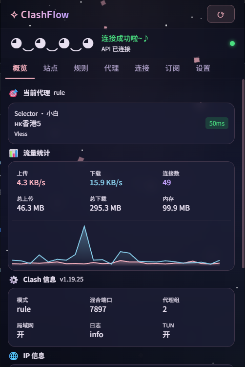
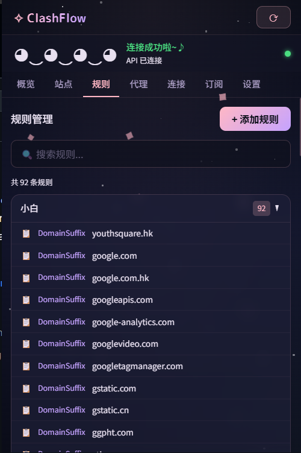
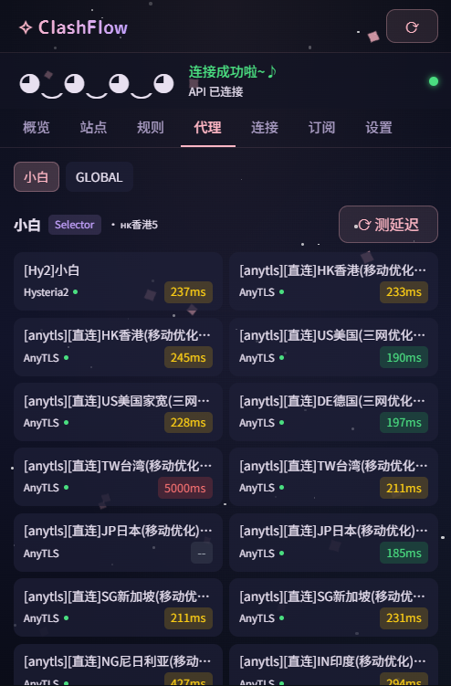
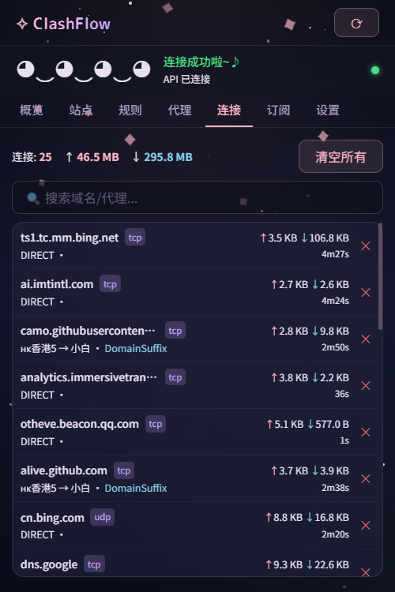
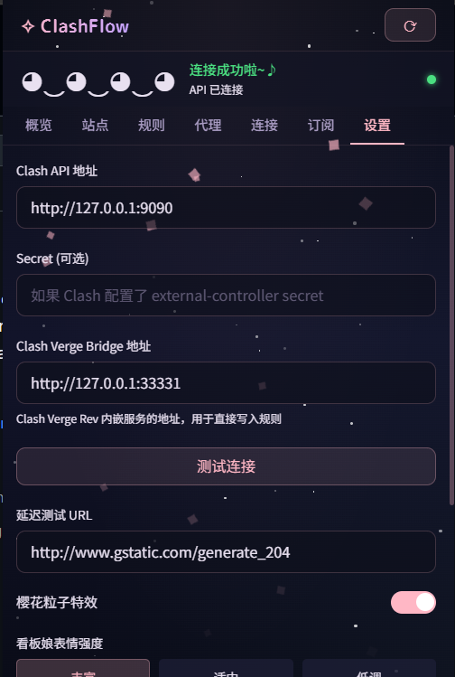

<h1 align="center">
  
  <br>
  Continuation of <a href="https://github.com/zzzgydi/clash-verge">Clash Verge</a>
  <br>
</h1>

<h3 align="center">
A Clash Meta GUI based on <a href="https://github.com/tauri-apps/tauri">Tauri</a>.
</h3>

<p align="center">
  Languages:
  <a href="./README.md">简体中文</a> ·
  <a href="./docs/README_en.md">English</a> ·
  <a href="./docs/README_es.md">Español</a> ·
  <a href="./docs/README_ru.md">Русский</a> ·
  <a href="./docs/README_ja.md">日本語</a> ·
  <a href="./docs/README_ko.md">한국어</a> ·
  <a href="./docs/README_fa.md">فارسی</a>
</p>

## Preview

| Dark                             | Light                             |
| -------------------------------- | --------------------------------- |
|  |  |

## Install

请到发布页面下载对应的安装包：[Release page](https://github.com/clash-verge-rev/clash-verge-rev/releases)<br>
Go to the [Release page](https://github.com/clash-verge-rev/clash-verge-rev/releases) to download the corresponding installation package<br>
Supports Windows (x64/x86), Linux (x64/arm64) and macOS 11+ (intel/apple).

#### 我应当怎样选择发行版

| 版本        | 特征                                     | 链接                                                                                   |
| :---------- | :--------------------------------------- | :------------------------------------------------------------------------------------- |
| Stable      | 正式版，高可靠性，适合日常使用。         | [Release](https://github.com/clash-verge-rev/clash-verge-rev/releases)                 |
| Alpha(废弃) | 测试发布流程。                           | [Alpha](https://github.com/clash-verge-rev/clash-verge-rev/releases/tag/alpha)         |
| AutoBuild   | 滚动更新版，适合测试反馈，可能存在缺陷。 | [AutoBuild](https://github.com/clash-verge-rev/clash-verge-rev/releases/tag/autobuild) |

#### 安装说明和常见问题，请到 [文档页](https://clash-verge-rev.github.io/) 查看

### TG 频道: [@clash_verge_rev](https://t.me/clash_verge_re)

---

## Promotion

### 🤖 [GPTKefu —— 与 Crisp 深度整合的 AI 智能客服平台](https://gptkefu.com)

- 🧠 深度理解完整对话上下文 + 图片识别，自动给出专业、精准的回复，告别机械式客服。
- ♾️ **不限回答数量**，无额度焦虑，区别于其他按条计费的 AI 客服产品。
- 💬 售前咨询、售后服务、复杂问题解答，全场景轻松覆盖，真实用户案例已验证效果。
- ⚡ 3 分钟极速接入，零门槛上手，即刻提升客服效率与客户满意度。
- 🎁 高级套餐免费试用 14 天，先体验后付费：👉 [立即试用](https://gptkefu.com)
- 📢 智能客服TG 频道：[@crisp_ai](https://t.me/crisp_ai)

---

## 🌐 ClashFlow 浏览器扩展

内置轻量级浏览器扩展 **ClashFlow**，在浏览器内直接管理 Clash 代理规则，无需切换到主程序。

### 功能列表

- **概览面板** — 当前代理节点 / 延迟显示、实时流量曲线、连接数、内存、IP 地理位置信息（通过 Clash 代理端口获取，保证显示出口 IP）、系统状态（运行模式 / 自启 / 版本）
- **站点规则管理** — 自动识别当前页面域名，显示是否已被规则覆盖；一键将当前站点（或问题域名）添加为 `DOMAIN` / `DOMAIN-SUFFIX` 规则到任意代理组
- **规则编辑** — 可视化管理所有 Clash 规则，支持新增 / 删除 / 排序
- **代理面板** — 切换代理组 / 节点，自动测延迟并以 `ms` 显示，节点颜色区分健康度
- **连接日志** — 实时显示当前活跃连接，可一键关闭
- **订阅管理** — 查看 / 切换配置文件、手动触发订阅更新
- **跨会话记忆** — 记住上次打开时停留的页面
- **智能过滤** — 已匹配规则的域名和广告拦截器（`ERR_BLOCKED_BY_CLIENT`）拦截的请求自动隐藏，问题列表只展示真正需要关注的域名；超过 1.5s 的慢请求会高亮显示

### 工作原理

扩展通过本地 HTTP Bridge（端口 `33331`，即 Clash Verge 的内嵌服务器）与主程序通信，所有 IP 信息 / 系统状态请求都经由 Clash 代理端口发出，因此 IP 显示的就是当前代理出口地址。规则添加通过 Bridge 注入到当前激活配置文件的 rules 增强文件，热重载无需重启内核。

### 截图

<p align="center">
  
  
  
  
  
  
</p>

### 安装使用

1. 从 [Releases](https://github.com/clash-verge-rev/clash-verge-rev/releases) 下载 `clashflow-extension.zip` 并解压
2. 打开 Chrome → `chrome://extensions` → 开启「开发者模式」
3. 点击「加载已解压的扩展程序」→ 选择解压后的文件夹
4. 确保 Clash Verge Rev 主程序正在运行（Bridge 端口 33331 可用）

> 扩展位于源码的 [`extension/`](./extension) 目录，可通过 `cd extension && pnpm install && pnpm build` 自行构建。

---

## Features

- 基于性能强劲的 Rust 和 Tauri 2 框架
- 内置[Clash.Meta(mihomo)](https://github.com/MetaCubeX/mihomo)内核，并支持切换 `Alpha` 版本内核。
- 简洁美观的用户界面，支持自定义主题颜色、代理组/托盘图标以及 `CSS Injection`。
- 配置文件管理和增强（Merge 和 Script），配置文件语法提示。
- 系统代理和守卫、`TUN(虚拟网卡)` 模式。
- 可视化节点和规则编辑
- WebDav 配置备份和同步
- **🌐 内置 ClashFlow 浏览器扩展** — 在 Chrome 内管理代理规则、查看流量和 IP 信息

### FAQ

Refer to [Doc FAQ Page](https://clash-verge-rev.github.io/faq/windows.html)

### Donation

[捐助Clash Verge Rev的开发](https://github.com/sponsors/clash-verge-rev)

## Development

See [CONTRIBUTING.md](./CONTRIBUTING.md) for more details.

To run the development server, execute the following commands after all prerequisites for **Tauri** are installed:

```shell
pnpm i
pnpm run prebuild
pnpm dev
```

## Contributions

Issue and PR welcome!

## Acknowledgement

Clash Verge rev was based on or inspired by these projects and so on:

- [zzzgydi/clash-verge](https://github.com/zzzgydi/clash-verge): A Clash GUI based on tauri. Supports Windows, macOS and Linux.
- [tauri-apps/tauri](https://github.com/tauri-apps/tauri): Build smaller, faster, and more secure desktop applications with a web frontend.
- [Dreamacro/clash](https://github.com/Dreamacro/clash): A rule-based tunnel in Go.
- [MetaCubeX/mihomo](https://github.com/MetaCubeX/mihomo): A rule-based tunnel in Go.
- [Fndroid/clash_for_windows_pkg](https://github.com/Fndroid/clash_for_windows_pkg): A Windows/macOS GUI based on Clash.
- [vitejs/vite](https://github.com/vitejs/vite): Next generation frontend tooling. It's fast!

## License

GPL-3.0 License. See [License here](./LICENSE) for details.
